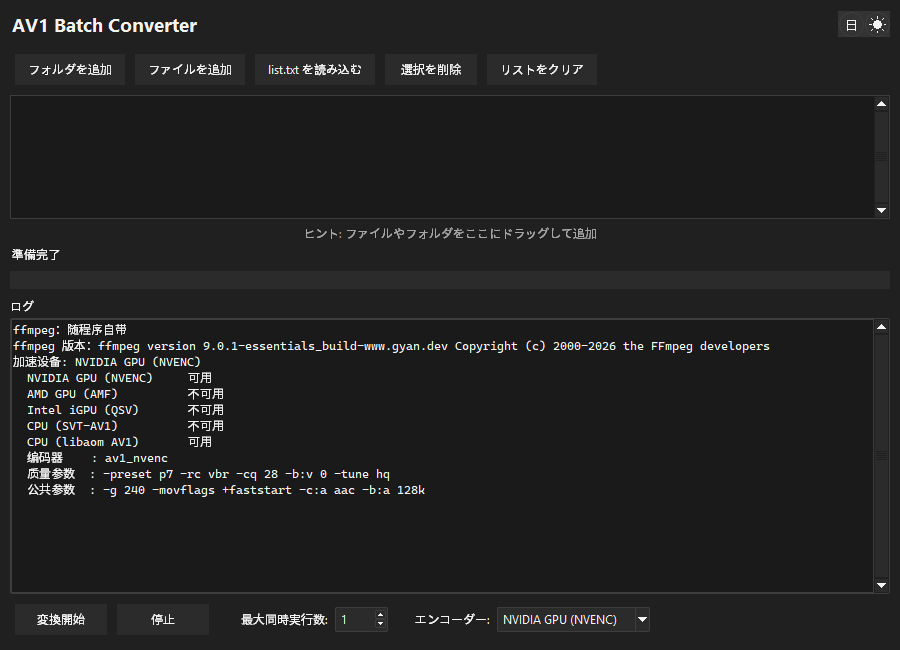
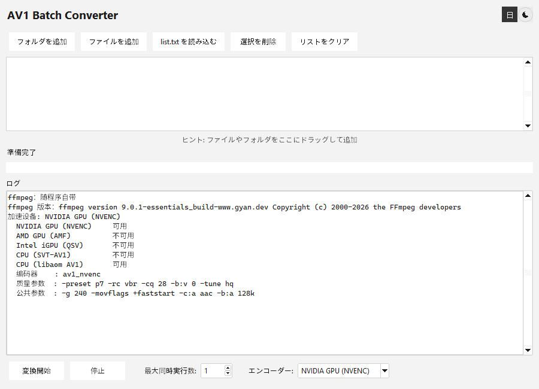

# AV1 Batch Converter

[English](README.md) | [简体中文](README.zh-CN.md) | **日本語**

動画をまとめて AV1 に変換する Windows 用の小さな GUI ツールです。フォルダを放り込んで、
使いたいアクセラレーション デバイスを選んで、開始を押すだけ。エンコーダーの一覧は
ハードウェア名から推測するのではなく、実際にこのマシンで試しエンコードして作られるので、
「選んだのに黙って失敗する」デバイスは出てきません。



## なぜ作ったか

数百個のファイルを `.bat` にドラッグする方法は破綻します。Windows のコマンドラインは
8191 文字で打ち切られるため、リストの後ろのほうが黙って落ちてしまいます。このツールは
ファイル一覧をプロセス内で受け取るので、その制限にかかりません。

## 機能

- **バッチ キュー** —— フォルダ追加、ファイル追加、ドラッグ＆ドロップ、`list.txt` の読み込み
- **アクセラレーター自動検出** —— NVIDIA / AMD / Intel / CPU を起動時に実測
- **3 言語 UI** —— 中文・日本語・英語。起動時はシステム言語に追従
- **ダーク / ライトテーマ**、Windows 11 のタイトルバー配色も連動
- **HiDPI 対応** —— 文字とレイアウトがウィンドウのあるモニターの拡大率に追従
- **並列変換** —— 同時 1〜16 ファイル
- **コンソール非表示** —— ffmpeg はバックグラウンドで実行

## 動作環境

- Windows 10 または 11
- ハードウェア アクセラレーションを使う場合は ffmpeg が扱える GPU
  （AV1 エンコードには新しいカードが必要: RTX 40 シリーズ、RX 7000 シリーズ、Arc 以降）

ffmpeg は **exe に同梱**されているので、追加インストールは不要です。
詳しくは[同梱の ffmpeg](#同梱の-ffmpeg)を参照してください。

## 使い方

インストーラーも前提条件もありません。[Releases](../../releases) から
`av1_batch_converter.exe` をダウンロードして実行してください。

ファイルの追加方法はどれでも構いません：

| 方法 | 説明 |
| --- | --- |
| **Add Folder** | フォルダ内を再帰的にスキャンして動画を集める |
| **Add Files** | 通常の複数選択ダイアログ |
| **ドラッグ＆ドロップ** | ファイルやフォルダをリストにドロップ |
| **Load list.txt** | 1 行 1 パス、`#` によるコメント可 |
| **コマンドライン引数** | ファイル/フォルダを引数で渡す、または exe にドロップ |

あとは**最大同時実行数**と**エンコーダー**を設定して **Start Conversion** を押します。

### 出力

各ファイルは元ファイルの隣に `<元の名前>.mp4`（AV1 を MP4 に格納）として出力され、
**元ファイルは削除されます**。変換は一時ファイル経由なので、途中で失敗しても
元ファイルには手が付きません。

## アクセラレーション デバイス

デバイス一覧はハードウェア名から推測していません。起動時に各候補で 2 フレームの
試しエンコードを実行し、成功を返したものだけを残します。「Intel 内蔵 GPU がある」＝
「AV1 をエンコードできる」ではないですし、AMD のランタイム DLL が欠けている状態は
「AMD カードが無い」状態と見分けが付かないからです。

使用できないデバイスはドロップダウンに残りますが、グレーアウトして選択できません。
既定では次の優先順で最初に使えるものが選ばれます：

| 優先度 | デバイス | エンコーダー | パラメータ |
| --- | --- | --- | --- |
| 1 | NVIDIA GPU | `av1_nvenc` | `-preset p7 -rc vbr -cq 28 -b:v 0 -tune hq` |
| 2 | AMD GPU | `av1_amf` | `-quality quality -rc cqp -qp_i 28 -qp_p 28` |
| 3 | Intel 内蔵 GPU | `av1_qsv` | `-preset 7 -global_quality 28` |
| 4 | CPU | `libsvtav1` | `-preset 6 -crf 30` |
| 5 | CPU | `libaom-av1` | `-cpu-used 6 -crf 30` |

全デバイス共通：`-g 240 -movflags +faststart -c:a aac -b:a 128k`

> 各行の `28` は**同じ画質ではありません**。cq、qp_i/qp_p、global_quality、crf は
> それぞれ別の尺度で、数値の意味が違います。似た見た目になるようにエンコーダーごとに
> 個別に選んだ値です。

CPU エンコードは GPU エンコードより 1〜2 桁遅いです。あくまでフォールバックで、
選択されたときはログにも表示されます。

ソフトウェア エンコーダーを 2 つ挙げているのは、どちらが存在するかが使う ffmpeg 次第だからです。
SVT-AV1 のほうが大幅に速いので、使えるならそちらが選ばれます。同梱の ffmpeg には
`libaom-av1` しかないため、素のインストールでは 5 行目になります。4 行目にしたい場合は
自分でフル版 ffmpeg を用意してください（[同梱の ffmpeg](#同梱の-ffmpeg) 参照）。

エンコーダーを切り替えると、実際に使われる引数がログに再表示されます：

```
  エンコーダー  : av1_nvenc
  品質パラメータ: -preset p7 -rc vbr -cq 28 -b:v 0 -tune hq
  共通パラメータ: -g 240 -movflags +faststart -c:a aac -b:a 128k
```

## 同梱の ffmpeg

exe は ffmpeg を内蔵しているので、まっさらな Windows でも設定なしで変換できます。
探す順番は次のとおりで、最初に見つかったものが使われます：

| 順序 | 場所 | 説明 |
| --- | --- | --- |
| 1 | exe と同じフォルダの `ffmpeg\ffmpeg.exe` | 自分で置いたものが最優先 |
| 2 | exe の内部 | 既定 |
| 3 | `PATH` 上の `ffmpeg` | 上の 2 つが無い場合のみ |

同梱版は `PATH` 上のものより**意図的に優先**されます。PC 全体に入れた ffmpeg は
忘れられがちで、「自分の環境では動く」という問題のほうが、予測可能な既定値より厄介だからです。
どれが使われたかはログの最初の 2 行が必ず示します：

```
ffmpeg: 同梱
ffmpeg バージョン: ffmpeg version 9.0.1-essentials_build-www.gyan.dev Copyright (c) 2000-2026 the FFmpeg developers
```

同梱のバイナリは [gyan.dev](https://www.gyan.dev/ffmpeg/builds/) の essentials ビルド 9.0.1 を
改変せずに含めたものです。**GPLv3** なので、ライセンスとビルド情報を
`ffmpeg\LICENSE` と `ffmpeg\README-ffmpeg.txt` として exe 内に同梱しており、対応する
ソースは [FFmpeg commit bf1b838f2a](https://github.com/FFmpeg/FFmpeg/commit/bf1b838f2a) です。
本プログラムは ffmpeg にリンクしておらず、別プロセスとして起動するだけなので、
プログラム本体は MIT のままです。

ダウンロード前に知っておきたいことが 2 点あります：

- exe は約 **48 MB** で、起動のたびに約 98 MB を `%TEMP%` に展開します。実測コストは
  起動時間**約 0.5 秒**（ウィンドウ表示が 1.5 秒 → 2.0 秒）。ダウンロード直後の初回は
  ウイルス対策ソフトが新しいバイナリを走査するため、さらに遅くなります。
- essentials ビルドには **SVT-AV1 が入っていない**ため、CPU モードは `libaom-av1` に
  フォールバックし、かなり遅くなります。SVT-AV1 を使いたい場合は**フル版** ffmpeg を
  ダウンロードし、その `ffmpeg.exe` を exe の隣の `ffmpeg` フォルダに置いてください。
  設定なしで自動的に認識されます。

## 画質：これは非可逆の再エンコードです

すべてのフレームをデコードしてから再エンコードします。コンテナの入れ替えでも
拡張子の変更でも**ありません**。画質は必ずいくらか落ち、しかも元ファイルは削除されるので
元に戻せません。

クリーンな 1080p 素材での実測では `-cq 28` は VMAF 96 —— ほとんどの内容で
見分けが付きません。画面全体がノイズの合成クリップでは、同じ設定が VMAF 74 まで
落ちます。cq の数値そのものより、素材の複雑さのほうがはるかに効きます。

残るもの・失われるものは、すべて実測結果です：

| 項目 | 結果 |
| --- | --- |
| 10bit 深度 | 保持（`yuv420p10le` が 8bit に潰されない） |
| HDR10 メタデータ | 完全に保持（bt2020nc + smpte2084 + mastering display + content light level） |
| **複数音声トラック** | **1 本目のみ保持、残りは黙って破棄** |
| **字幕** | **すべて破棄** |
| 音声 | AAC 128k に強制変換。可逆や高ビットレート音源は劣化します |

これらが気になる素材は、素の ffmpeg で変換してください。

## 言語とテーマ

ヘッダーに 2 つのアイコンボタンがあります。言語ボタンはテーマボタンの左にあり、
現在の言語（`中` / `日` / `EN`）を表示します。クリックで 中文 → 日本語 → English と
巡回します。初期言語は Windows の UI 言語に追従します。



どちらの選択も保存されないので、起動のたびにソース内の既定値から始まります。

## HiDPI

UI は per-monitor DPI aware で、文字とレイアウトはウィンドウのあるモニターに追従します。
100% の画面から 150% の画面へウィンドウを移動すると、文字が小さいままになるのではなく
自動で再スケールされます。

## ソースからビルド

`av1_batch_converter.pyw` がプログラム全体です —— Python + tkinter で、
`pywinstyles`（任意、タイトルバーのテーマ用）と `tkinterdnd2`（ドラッグ＆ドロップ用）
以外に実行時依存はありません。

```bat
python -m pip install pyinstaller tkinterdnd2 pywinstyles
python vendor\fetch_ffmpeg.py
pyinstaller av1_batch_converter.spec --noconfirm --distpath dist --workpath build
```

`vendor\fetch_ffmpeg.py` は固定バージョンの ffmpeg を `vendor\ffmpeg\` にダウンロードし、
記録済みの SHA-256 で検証します。つまり再現可能で、しかも git にコミットする必要が
ありません。これが無いと spec はビルドを中止します —— ffmpeg を同梱していない exe を
黙って作ってしまうより、失敗したほうがましだからです。

`build.bat` は同じ処理を専用の virtualenv で行い、`dist\av1_batch_converter.exe` を残します。

Python 3.13 の注意点：tkinterdnd2 を import する前に
`sys.modules["tkinter.tix"] = tkinter` を追加してください。削除された `tkinter.tix` が
原因で import に失敗します。

## 開発ノート

実装の詳細、踏んだ落とし穴、検証スクリプト、計測手法は
[DEVELOPMENT.md](DEVELOPMENT.md)（中国語）にあります。

## ライセンス

プログラム本体は [MIT](LICENSE) です。

同梱の ffmpeg バイナリは **GPLv3**（© FFmpeg developers）で、改変せずに再配布しています ——
ライセンス、ビルド情報、対応ソースは[同梱の ffmpeg](#同梱の-ffmpeg)を参照してください。
