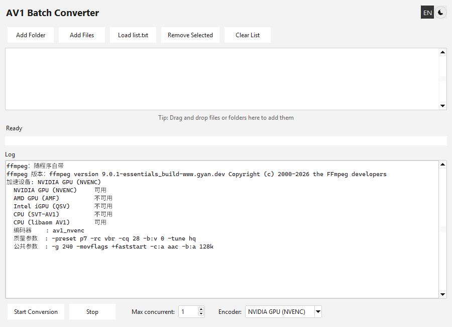

# AV1 Batch Converter

**English** | [简体中文](README.zh-CN.md) | [日本語](README.ja.md)

A small Windows GUI for batch-converting videos to AV1. Drop in a folder, pick the
acceleration device you want, hit start. The encoder list is built by actually
probing your machine, so you never get a device that silently fails.


## Why this exists

Dragging a few hundred files onto a `.bat` script fails: Windows caps a command line
at 8191 characters, so the tail of the list is silently dropped. This tool takes the
file list in-process instead, so the limit does not apply.

## Features

- **Batch queue** — add a folder, add files, drag and drop, or load a `list.txt`
- **Automatic accelerator detection** — NVIDIA / AMD / Intel / CPU, probed at startup
- **Multilingual UI** — Chinese, Japanese and English, follows your system language
- **Dark and light theme**, plus the matching Windows 11 title bar
- **HiDPI aware** — text and layout scale to whichever monitor the window is on
- **Parallel conversion** — 1 to 16 files at a time
- **No console windows** — ffmpeg runs hidden

## Requirements

- Windows 10 or 11
- A GPU whose encoder ffmpeg can drive, if you want hardware acceleration
  (AV1 encoding needs a recent card: RTX 40 series, RX 7000 series, Arc, or newer)

ffmpeg is **bundled inside the exe**, so there is nothing to install. See
[Bundled ffmpeg](#bundled-ffmpeg).

## Usage

There is no installer and no prerequisite. Download `av1_batch_converter.exe` from
[Releases](../../releases) and run it.

Add files in whichever way suits you:

| Method | Notes |
| --- | --- |
| **Add Folder** | Scans the folder recursively for video files |
| **Add Files** | Normal multi-select file dialog |
| **Drag and drop** | Drop files or folders onto the list |
| **Load list.txt** | One path per line, `#` comments allowed |
| **Command line** | Pass files or folders as arguments, or drop them onto the exe |

Then set **Max concurrent** and the **Encoder**, and press **Start Conversion**.

### Output

Each file is written next to its source as `<name>.mp4` (AV1 in an MP4 container) and
**the original file is deleted**. Conversion goes through a temp file, so a failure
leaves your source untouched.

## Acceleration devices

The device list is not guessed from hardware names. At startup the program runs a
two-frame test encode with each candidate and keeps the ones that return success.
That matters because "has an Intel iGPU" does not mean "can encode AV1", and a
missing AMD runtime DLL looks exactly like no AMD card at all.

Unavailable devices stay in the dropdown but are greyed out and cannot be selected.
The first usable device in this order is picked by default:

| Priority | Device | Encoder | Parameters |
| --- | --- | --- | --- |
| 1 | NVIDIA GPU | `av1_nvenc` | `-preset p7 -rc vbr -cq 28 -b:v 0 -tune hq` |
| 2 | AMD GPU | `av1_amf` | `-quality quality -rc cqp -qp_i 28 -qp_p 28` |
| 3 | Intel iGPU | `av1_qsv` | `-preset 7 -global_quality 28` |
| 4 | CPU | `libsvtav1` | `-preset 6 -crf 30` |
| 5 | CPU | `libaom-av1` | `-cpu-used 6 -crf 30` |

Common to every device: `-g 240 -movflags +faststart -c:a aac -b:a 128k`

> The `28` in each row is **not** the same quality. The cq, qp_i/qp_p, global_quality
> and crf scales are not equivalent, so the numbers were chosen per encoder to land
> in a similar visual range.

CPU encoding is one to two orders of magnitude slower than a GPU encoder. It is the
fallback, and the log says so when it is selected.

Two software encoders are listed because which one exists depends on the ffmpeg in
use. SVT-AV1 is much faster and wins when it is there, which is why it is tried
first; the bundled ffmpeg has `libaom-av1` only, so a stock install lands on row 5.
Supply your own full ffmpeg build (see [Bundled ffmpeg](#bundled-ffmpeg)) to get
row 4 instead.

When the encoder changes, the log reprints the exact arguments in use:

```
  encoder    : av1_nvenc
  quality    : -preset p7 -rc vbr -cq 28 -b:v 0 -tune hq
  common     : -g 240 -movflags +faststart -c:a aac -b:a 128k
```

## Bundled ffmpeg

The exe carries its own ffmpeg, so a fresh Windows install can transcode without
setting anything up. It is looked for in this order, first hit wins:

| Order | Location | Why |
| --- | --- | --- |
| 1 | `ffmpeg\ffmpeg.exe` beside the exe | Your own build overrides everything else |
| 2 | Inside the exe | The default |
| 3 | `ffmpeg` on your `PATH` | Only reached if neither of the above exists |

The bundled copy deliberately beats a copy on `PATH`: a machine-wide ffmpeg is
easy to forget about, and "works on my machine" bugs are worse than a predictable
default. The first two lines of the log always say which one answered:

```
ffmpeg: bundled with the program
ffmpeg version: ffmpeg version 9.0.1-essentials_build-www.gyan.dev Copyright (c) 2000-2026 the FFmpeg developers
```

The bundled binary is [gyan.dev](https://www.gyan.dev/ffmpeg/builds/)'s essentials
build 9.0.1, included unmodified. It is **GPLv3**, so its licence and build notes
ship inside the exe as `ffmpeg\LICENSE` and `ffmpeg\README-ffmpeg.txt`, and the
matching source is
[FFmpeg commit bf1b838f2a](https://github.com/FFmpeg/FFmpeg/commit/bf1b838f2a).
This program never links against ffmpeg — it launches it as a separate process —
which is why the program itself stays MIT.

Two consequences worth knowing before you download:

- The exe is about **48 MB**, and unpacks roughly 98 MB into `%TEMP%` on every
  launch. Measured cost: **about half a second** of extra startup on an SSD
  (1.5 s → 2.0 s to a visible window). The first launch after a download is slower
  because the antivirus scans the new binary.
- The essentials build has **no SVT-AV1**, so CPU mode falls back to `libaom-av1`,
  which is considerably slower. To get SVT-AV1 back, download a *full* ffmpeg
  build and drop its `ffmpeg.exe` into an `ffmpeg` folder next to the exe; it is
  then picked up automatically, with no configuration.

## Quality: this is a lossy re-encode

Every frame is decoded and encoded again. It is **not** a container swap or a rename,
quality always drops somewhat, and the original is deleted, so it cannot be undone.

Measured on clean 1080p footage, `-cq 28` scores VMAF 96 — visually indistinguishable
for most content. On a synthetic clip that is noisy across the whole frame the same
setting drops to VMAF 74. Source complexity matters far more than the cq number.

What survives and what does not, all measured:

| Item | Result |
| --- | --- |
| 10-bit depth | Kept (`yuv420p10le` is not flattened to 8-bit) |
| HDR10 metadata | Fully kept (bt2020nc + smpte2084 + mastering display + content light level) |
| **Multiple audio tracks** | **Only the first is kept, the rest are dropped silently** |
| **Subtitles** | **All dropped** |
| Audio | Forced to AAC 128k, so lossless or high-bitrate sources lose quality |

If any of those matter for your footage, convert with plain ffmpeg instead.

## Languages and theme

The header has two icon buttons. The language button sits to the left of the theme
button and shows the current language (`中` / `日` / `EN`); clicking cycles
Chinese → Japanese → English. The initial language follows your Windows UI language.



Neither choice is persisted, so each launch starts from the defaults in the source.

## HiDPI

The UI is per-monitor DPI aware, and text plus layout follow the monitor the window
is on. Dragging the window from a 100% display to a 150% one rescales it instead of
leaving everything tiny.

## Build from source

`av1_batch_converter.pyw` is the whole program — Python and tkinter, no other runtime
dependency beyond `pywinstyles` (optional, for the themed title bar) and
`tkinterdnd2` (for drag and drop).

```bat
python -m pip install pyinstaller tkinterdnd2 pywinstyles
python vendor\fetch_ffmpeg.py
pyinstaller av1_batch_converter.spec --noconfirm --distpath dist --workpath build
```

`vendor\fetch_ffmpeg.py` downloads the pinned ffmpeg build into `vendor\ffmpeg\`
and checks it against a recorded SHA-256, so the binary is reproducible without
ever being committed to git. The spec refuses to build if it is missing, rather
than quietly producing an exe with no ffmpeg inside it.

`build.bat` does the same thing against a dedicated virtualenv and leaves
`dist\av1_batch_converter.exe`.

Note for Python 3.13: add `sys.modules["tkinter.tix"] = tkinter` before importing
tkinterdnd2, or the import fails on the removed `tkinter.tix` module.

## Development notes

Engineering notes — implementation details, pitfalls, verification scripts and the
measurement methodology — are in [DEVELOPMENT.md](DEVELOPMENT.md) (Chinese).

## License

The program is [MIT](LICENSE).

The bundled ffmpeg binary is **GPLv3**, © the FFmpeg developers, redistributed
unmodified — see [Bundled ffmpeg](#bundled-ffmpeg) for the licence, build notes
and the source it was built from.
