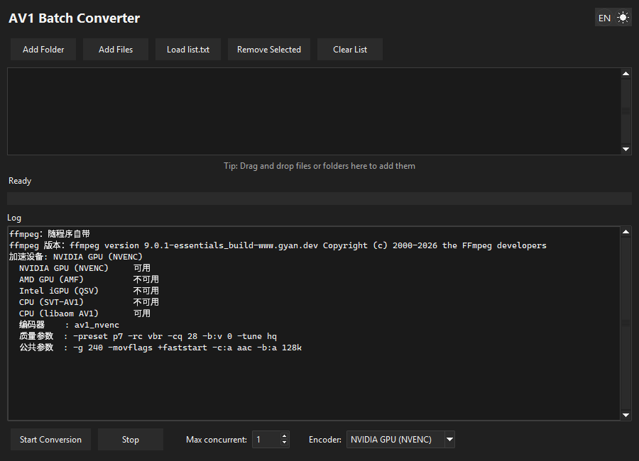

# AV1 Batch Converter

**English** | [简体中文](README.zh-CN.md) | [日本語](README.ja.md)

A small Windows tool for batch-converting videos to AV1.



## Features

- **Batch queue** — add a folder, add files, drag and drop, or load a `list.txt`
- **Automatic accelerator detection** — NVIDIA / AMD / Intel / CPU, probed at startup
- **Parallel conversion** — 1 to 16 files at a time

## Requirements

- Windows 10 or 11
- ffmpeg is bundled in the exe, so there is nothing to install
  (a `ffmpeg\` folder beside the exe, or a copy on `PATH`, takes priority)
- A GPU whose encoder ffmpeg can drive, if you want hardware acceleration
  (AV1 encoding needs a recent card: RTX 40 series, RX 7000 series, Arc, or newer)

### Output

Each file is written next to its source as `<name>.mp4` (AV1 in an MP4 container) and
**the original file is deleted**. Conversion goes through a temp file, so a failure
leaves your source untouched.

## Build from source

`av1_batch_converter.pyw` is the whole program — Python and tkinter, no other runtime
dependency beyond `pywinstyles` (optional, for the themed title bar) and
`tkinterdnd2` (for drag and drop).

```bat
python -m pip install pyinstaller tkinterdnd2 pywinstyles
python vendor\fetch_ffmpeg.py
pyinstaller av1_batch_converter.spec --noconfirm --distpath dist --workpath build
```

`build.bat` does the same thing (fetching and verifying ffmpeg first) and leaves
`dist\av1_batch_converter.exe`.

## License

[MIT](LICENSE). The bundled ffmpeg is **GPLv3** (© the FFmpeg developers),
distributed together with the exe.
