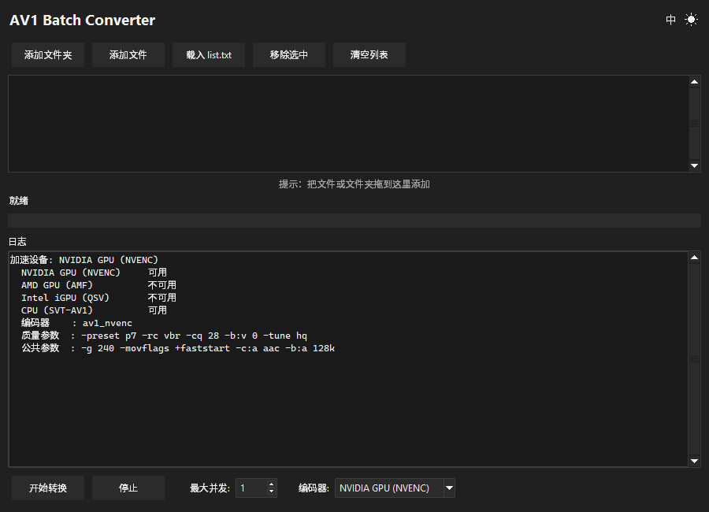
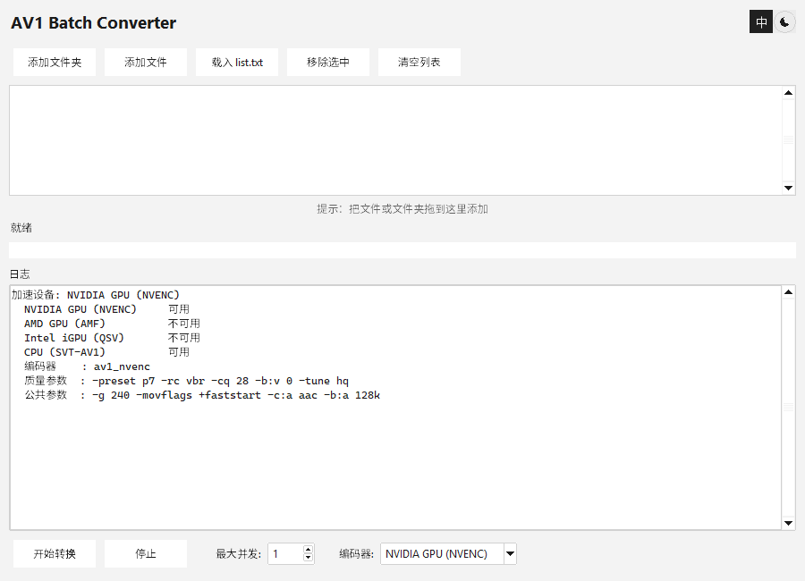

# AV1 Batch Converter

[English](README.md) | **简体中文** | [日本語](README.ja.md)

一个用来把视频批量转成 AV1 的 Windows 小工具。把文件夹丢进去，选好加速设备，点开始就行。
加速设备列表不是照着硬件名猜的，而是真的在你机器上跑一遍试编码，所以不会出现"选了某个设备却静默失败"。



## 为什么要做这个

把几百个文件拖到 `.bat` 上是行不通的：Windows 命令行上限 8191 个字符，超出部分的文件会被悄悄丢掉。
这个工具在进程内直接拿文件列表，所以没有这个限制。

## 功能

- **批量队列** —— 添加文件夹、添加文件、拖放，或者载入 `list.txt`
- **自动检测加速设备** —— NVIDIA / AMD / Intel / CPU，启动时实测
- **三语界面** —— 中文、日文、英文，启动时跟随系统语言
- **深色 / 浅色主题**，并同步 Windows 11 标题栏配色
- **HiDPI 适配** —— 文字和布局跟随窗口所在显示器的缩放
- **并发转换** —— 一次 1 到 16 个文件
- **不弹黑框** —— ffmpeg 在后台隐藏运行

## 运行要求

- Windows 10 或 11
- `PATH` 中有 [ffmpeg](https://ffmpeg.org/download.html)
- 想用硬件加速的话，需要一块 ffmpeg 能驱动的显卡
  （AV1 编码要求较新的卡：RTX 40 系、RX 7000 系、Arc 或更新）

## 使用方法

没有安装程序。从 [Releases](../../releases) 下载 `av1_batch_converter.exe` 直接运行即可。

加文件的方式随便挑：

| 方式 | 说明 |
| --- | --- |
| **Add Folder** | 递归扫描文件夹里的视频 |
| **Add Files** | 常规的多选文件对话框 |
| **拖放** | 把文件或文件夹拖到列表上 |
| **Load list.txt** | 一行一个路径，支持 `#` 注释 |
| **命令行参数** | 把文件/文件夹作为参数传给它，或直接拖到 exe 上 |

然后设置**最大并发**和**编码器**，点 **Start Conversion**。

### 输出

每个文件输出到源文件旁边，命名为 `<原名>.mp4`（AV1 封装进 MP4），并且**会删除原文件**。
转换走临时文件，所以中途失败不会动你的源文件。

## 加速设备

设备列表不是靠硬件名猜的。启动时程序会拿每个候选设备跑一次两帧的试编码，只保留返回成功的那些。
这一点很重要：有 Intel 核显不等于能编 AV1，缺了 AMD 运行库 DLL 的机器看起来和"没有 AMD 卡"一模一样。

不可用的设备会留在下拉框里，但置灰、点不动。默认按下面的优先级取第一个可用设备：

| 优先级 | 设备 | 编码器 | 参数 |
| --- | --- | --- | --- |
| 1 | NVIDIA 显卡 | `av1_nvenc` | `-preset p7 -rc vbr -cq 28 -b:v 0 -tune hq` |
| 2 | AMD 显卡 | `av1_amf` | `-quality quality -rc cqp -qp_i 28 -qp_p 28` |
| 3 | Intel 核显 | `av1_qsv` | `-preset 7 -global_quality 28` |
| 4 | CPU | `libsvtav1` | `-preset 6 -crf 30` |

所有设备共用：`-g 240 -movflags +faststart -c:a aac -b:a 128k`

> 每行里的 `28` **不是**同一个质量档位。cq、qp_i/qp_p、global_quality、crf 这几套刻度并不等价，
> 这些数字是按各编码器分别挑的，目的是让观感落在相近区间。

用 SVT-AV1 走 CPU 会比 GPU 编码慢一到两个数量级。它是兜底方案，选中时日志里也会提示。

切换编码器时，日志会重新打印当前实际使用的参数：

```
  编码器    : av1_nvenc
  质量参数  : -preset p7 -rc vbr -cq 28 -b:v 0 -tune hq
  公共参数  : -g 240 -movflags +faststart -c:a aac -b:a 128k
```

## 画质：这是有损重编码

每一帧都会被解码再重新编码。它**不是**换容器、也不是改后缀，画质必然有一定下降，
而且原文件会被删除，所以无法撤销。

在干净的 1080p 片源上实测，`-cq 28` 的 VMAF 为 96 —— 对大多数内容来说肉眼分辨不出来。
在一段整幅画面都是噪点的合成素材上，同样的设置会掉到 VMAF 74。片源复杂度的影响远大于 cq 数字本身。

哪些东西会保留、哪些会丢，都是实测结论：

| 项目 | 结果 |
| --- | --- |
| 10bit 位深 | 保留（`yuv420p10le` 不会被压成 8bit） |
| HDR10 元数据 | 完整保留（bt2020nc + smpte2084 + mastering display + content light level） |
| **多音轨** | **只保留第一条，其余静默丢弃** |
| **字幕** | **全部丢弃** |
| 音频 | 强制转 AAC 128k，无损或高码率音源会有损失 |

如果这些对你要转的片子有影响，请改用原版 ffmpeg 手动转换。

## 语言与主题

标题栏右侧有两个图标按钮。语言按钮在主题按钮左边，显示当前语言（`中` / `日` / `EN`），
点击按 中文 → 日文 → 英文 循环。初始语言跟随 Windows 界面语言。



两项选择都不会持久化，每次启动都用源码里的默认值。

## HiDPI

界面是 per-monitor DPI aware 的，文字和布局跟随窗口所在显示器缩放。
把窗口从 100% 的显示器拖到 150% 的显示器上，它会自动重新缩放，而不是让文字一直那么小。

## 从源码构建

`av1_batch_converter.pyw` 就是整个程序 —— Python + tkinter，除了 `pywinstyles`
（可选，用于标题栏主题）和 `tkinterdnd2`（拖放）之外没有别的运行时依赖。

```bat
python -m pip install pyinstaller tkinterdnd2 pywinstyles
pyinstaller av1_batch_converter.spec --noconfirm --distpath dist --workpath build
```

`build.bat` 做的是同一件事，只是跑在专用的 virtualenv 里，产物是 `dist\av1_batch_converter.exe`。

Python 3.13 需要注意：在 import tkinterdnd2 之前加上 `sys.modules["tkinter.tix"] = tkinter`，
否则会因为 `tkinter.tix` 被移除而导入失败。

## 开发笔记

实现细节、踩过的坑、验证脚本和测量方法都在 [DEVELOPMENT.md](DEVELOPMENT.md)（中文）。

## 许可证

[MIT](LICENSE)
